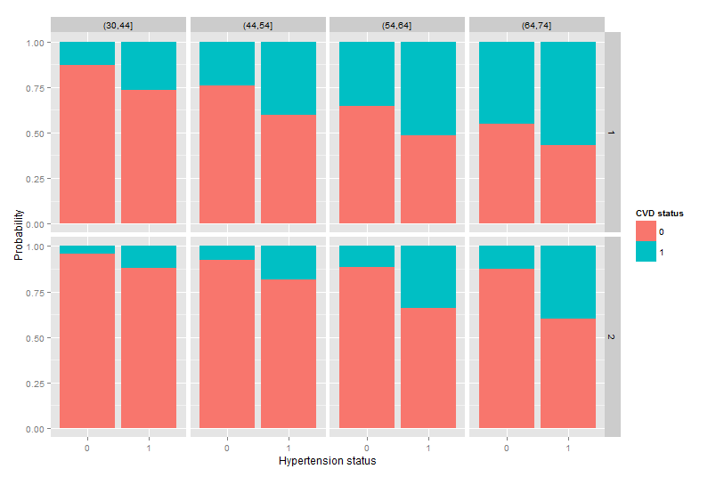
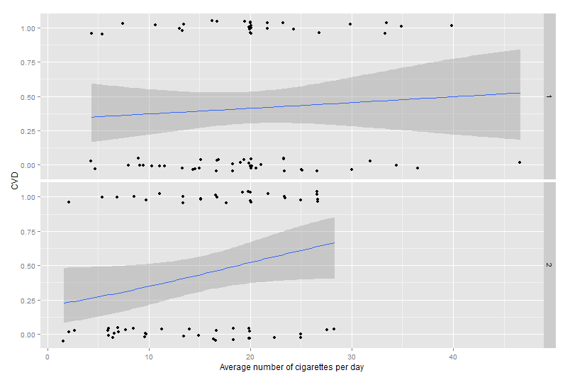
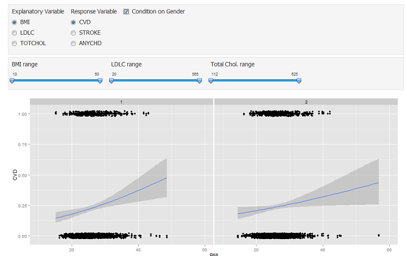
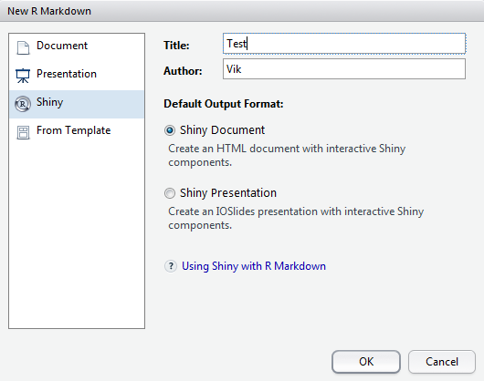

## Outline
* **Introduction to Framingham Heart Study**
    * Goals  
* R and RStudio   
    * Installation   
    * R Basics   
* Data Manipulation with `dplyr`
    * Data Manipulation Verbs  
    * Manipulating the FHS Data  
* The Grammar of Graphics with `ggplot2`
    * Elements of a Graphic   
    * Using `ggplot2` with FHS Data
* Interactive Plots with `shiny`
    * Basic Concepts   
    * Exploring Logistic Regression with FHS Data 
   
## The Framingham Heart Study (FHS)
* A Long term study of Cardiovascular Disease (CVD) among subjects in 
  Framingham, USA.
* Began in 1948 with 5209 subjects.
* Patients examined every 2 years for
    * Clinical examination data  
    * Cardiovascular outcomes  
* More information about the study can be found at the FHS
  [official website](http://www.framinghamheartstudy.org/)
 
## Some Findings of the FHS
* Over 1000 medical papers have been published using the data from the FHS.
* The study has uncovered or confirmed several risk factors for CVD:
    * High blood pressure
    * Obesity
    * Cigarette smoking
* The study has also shown there are differences in cardiovascular risk between
  men and women.
  
## Our Dataset
> - We have a subset of the original dataset, pertaining to 4434 patients.
> - Each of these patients was followed for a total of 24 years, but we 
  only have
  data on their clinical examinations for a period of 6 years, 
  spanning 1956 to 1968. 
    * The data is provided in Longitudinal form.
    * Each participant has 1 to 3 observations.
    * There are a total of 11627 rows in the data.

## Columns in Our Dataset
Here are the *first six columns and rows* of our dataset:
```{r echo=FALSE}
fhs.long <- read.csv("../data/frmgham2.csv")
head(fhs.long[,1:6])
```
> - `RANDID` refers to the patient id.
> - The remaining columns are measurements on the patients during their
  examinations, and outcome measures. 

## Measurements in Our Dataset
Variable | Explanation
---------|------------
SEX    | 1 for males and 2 for females.   
PERIOD | An integer between 1 and 3 denoting the examination number.  
AGE    | Age at examination (in years).  
SYSBP, DIABP |  Systolic and diastolic blood pressure.   
CIGPDAY | Number of cigarettes smoked per day.   
BMI | Body Mass Index.
LDLC | Low density cholesterol.
TOTCHOL | Total cholesterol.

## Outcome Measures in Our Dataset
Variable | Explanation
---------|------------
STROKE | 1 if patient experienced a stroke during the 12 years and 0 otherwise.   
ANYCHD | 1 if patient experienced a Coronary Heart Disease during the 12 years and 0 otherwise.   
CVD    | 1 if patient experienced a Cerebrovascular Disease during the 12 years and 0 otherwise.   
HYPERTEN | 1 if patient has hypertension, which is defined to be Systolic greater than 140mmHg or Diastolic greater than 90mmHg.

## Outline
* Introduction to Framingham Heart Study  
    * **Goals**
* R and RStudio   
    * Installation   
    * R Basics   
* Data Manipulation with `dplyr`
    * Data Manipulation Verbs  
    * Manipulating the FHS Data  
* The Grammar of Graphics with `ggplot2`
    * Elements of a Graphic   
    * Using `ggplot2` with FHS Data
* Interactive Plots with `shiny`
    * Basic Concepts   
    * Exploring Logistic Regression with FHS Data 
   
## Goal 1 


## Goal 1 | Insights

* Increased association of hypertension with cerebrovascular disease in elderly.
* For a given age group, association of hypertension with cerebrovascular
  disease is greater for males than females.

Warning:

*  *Our data is censored - we only have data for a period of 12 years.*

## Goal 2 


## Goal 2 | Insights

* Number of cigarettes smoked is associated with CVD.
* The effect of cigarettes seems to be larger for females than for males.

## Goal 3 


## Goal 3 | Details
- There are several measurements in our data set.
- There are also several responses.
- We could look at plots of one combination at a time.
- Or, we could use the shiny app to explore several combinations at one go,
  excluding outliers manually and even conditioning on gender!

## Outline
* Introduction to Framingham Heart Study  
    * Goals
* **R and RStudio**   
    * Installation   
    * R Basics   
* Data Manipulation with `dplyr`
    * Data Manipulation Verbs  
    * Manipulating the FHS Data  
* The Grammar of Graphics with `ggplot2`
    * Elements of a Graphic   
    * Using `ggplot2` with FHS Data
* Interactive Plots with `shiny`
    * Basic Concepts   
    * Exploring Logistic Regression with FHS Data 

## Outline
* Introduction to Framingham Heart Study  
    * Goals
* R and RStudio   
    * **Installation**   
    * R Basics   
* Data Manipulation with `dplyr`
    * Data Manipulation Verbs  
    * Manipulating the FHS Data  
* The Grammar of Graphics with `ggplot2`
    * Elements of a Graphic   
    * Using `ggplot2` with FHS Data
* Interactive Plots with `shiny`
    * Basic Concepts   
    * Exploring Logistic Regression with FHS Data 

## Installing R
* Go to [CRAN](http://cran.r-project.org "Comprehensive R Archive Network").
* Click on the link corresponding to your OS.
* **Please install R version 3.1.0 for this workshop.**

**If you are using OS X, it is highly recommended that you install the version
for Snow Leopard rather than Mavericks.**
 
## About RStudio
* RStudio is an Integrated Development Environment (IDE) developed specifically
  for R coding.
* It is free, and provides a familiar interface to programmers with features
  such as 
    * Execution of source code directly from the source editor.
    * Syntax highlighting and code completion.
    * History of plots, commands and help files.
* It is certainly good for a newcomer to R, but it is also the environment of
  choice for many advanced users.

## Installing RStudio
* Go to [RStudio](http://www.rstudio.com/ide/download/ "RStudio Downloads")
* Download the **RStudio Desktop** and install the appropriate version for your
  OS.
* **Please install at least version 0.98.932 for this workshop.**


## Navigating RStudio


*  Console  
*  Source code editor     
*  History panel     
*  Plot/Help/Package Installation panel     

## Required R Packages
Make sure you have the following packages installed for this workshop:

*  dplyr    
*  ggplot2   
*  shiny    

Use the **Packages** tab in panel number 4, and make sure that all dependencies
are installed as well.

## Ready To Go? | dplyr
Checking on `dplyr`:
```{r eval=TRUE}
library(dplyr)
```

> - No news is good news!

## Ready To Go? | ggplot2
Checking on ggplot2:
```{r}
library(ggplot2)
```

> - No news is good news!

## Ready To Go? | shiny test

*  Open RStudio, go to *File > New File > R Markdown*   
*  Select **Shiny** on the left.
*  Fill in the **Title** and **Author** fields and click OK.



## Ready To Go? | shiny success

*  Save the newly created file in the console.  
*  Click on **Run Document**.  


## Working Directory

*  We are going to start running R code.
*  Hence we need to be in a position to access the data and code for this
   workshop.
*  Go to *Session > Set Working Directory > Choose Directory*.
*  If your data is stored in `D:/Users/viknesh/bdah/data/`
    * Set your working directory to be `D:/Users/viknesh/bdah/`

## Outline
* Introduction to Framingham Heart Study  
    * Goals
* R and RStudio   
    * Installation   
    * **R Basics**   
* Data Manipulation with `dplyr`
    * Data Manipulation Verbs  
    * Manipulating the FHS Data  
* The Grammar of Graphics with `ggplot2`
    * Elements of a Graphic   
    * Using `ggplot2` with FHS Data
* Interactive Plots with `shiny`
    * Basic Concepts   
    * Exploring Logistic Regression with FHS Data 

## R Data Objects
*  R is a language for statistical computing.
*  Statistics is about understanding data.
*  Hence we need to know a little about how R represents data.
*  The main data structures that R uses are 
    *  vectors,
    *  matrices and
    *  data frames.

## Vectors
*  R has no scalars, only **vectors**.
*  Think of a vector as an ordered string of *things that are alike*. These
  *things* could be 
    * integers,
    * real numbers,
    * words, and so on and so forth.
*  Here's how we create and print vectors in R.
```{r}
Z <- c(7.3, 2, 13.1)
Z
```
*  The `c()` function stands for `catenate`.

## Accessing Elements in a Vector
*  The `:` operator creates a sequence of integers, which can then be used to
   access individual elements in a vector.
```{r}
Z[1:2]
```
*  When a negative sign is added in front, it means that the values at these
   indices should be dropped.
```{r}
Z[-(1:2)]
```

## Exercise 1
Try out the following tasks, that pertain to vectors.

*  Run the following code, and try to figure out what it does:
```{r eval=FALSE}
Z[c(1,3)]
```
   How is it different from `Z[-2]`?  

*  The expression `1:5` creates the vector `c(1,2,3,4,5)`. What does `5:1` do?  
*  How can we create a vector `c(1.2, 2.2, 3.2, 4.2)`?  

## Matrices
*  Matrices are 2-dimensional arrays with all elements of the same type. 
```{r}
mymat <- matrix(1:9, nrow=3, ncol=3)
mymat
```
*  Matrix elements are accessed with the same syntax as vectors, except that
   there is a comma to separate the column and row references.

## Accessing Elements Within a Matrix
*  Accessing the element in row 3 and column 2:
```{r}
mymat[3,2]
```
*  Accessing row 3:
```{r}
mymat[3, ]
```

## Accessing Elements Within a Matrix
*  Accessing columns 2 and 3 of rows 1 and 3:
```{r}
mymat[c(1,3), c(2,3)]
```

## Data Frames
> - A data frame is the common construct used to store data in R.
> - It is very similar to a matrix, and the syntax to access the elements is
    identical to that of a matrix.
> - The difference is this:
    *  Within columns, the elements are all alike.
    *  However, the columns are not all of the same type.
> -  Let's look at an example.

## Creating Data Frames
The following code creates a data frame:
```{r}
tea.type <- c("black", "red", "green")
cost <- c(4, 5, 5.5)
tea.df <- data.frame(cost, tea.type)
tea.df
```
*  As is clear, one column consists of numerals, whereas the other consists of
   characters or words.

## Exercise 2
*  Retrieve the element in row 3 and column 2 of the `tea.df` data frame.  
*  What does the following expression return?
```{r eval=FALSE}
tea.df$cost
```

## Outline
* Introduction to Framingham Heart Study  
    * Goals
* R and RStudio   
    * Installation   
    * R Basics   
* **Data Manipulation with `dplyr`**
    * Data Manipulation Verbs  
    * Manipulating the FHS Data  
* The Grammar of Graphics with `ggplot2`
    * Elements of a Graphic   
    * Using `ggplot2` with FHS Data
* Interactive Plots with `shiny`
    * Basic Concepts   
    * Exploring Logistic Regression with FHS Data 

## Our Dataset
```{r echo=FALSE}
setwd('../')
```
The following command reads in our dataset as a data frame.
```{r}
fhs.long <- read.csv("../data/frmgham2.csv", header=TRUE)

## We are going to need this from now on too.
library(dplyr) 
```   
*  Within panel 3 of RStudio, click on the *Environment* tab.  
*  Click on the spreadsheet icon next to the `fhs.long` object.  

## Our Immediate Target
*  We need to extract the subset of data that we need for Goal 1.
*  Recall that our dataset contains 1 to 3 visits for each subject.
*  We need to extract only the information for the first visit, and also to
   create the age categories.
*  Selected columns from our final dataset should look something like this:
```
RANDID SEX HYPERTEN STROKE CVD AGE.CAT PERIOD
1234     1   0         1    1  (30,44]   1
2345     2   1         0    0  (44,54]   1
3456     2   0         0    0  (30,44]   1
```

## Outline
* Introduction to Framingham Heart Study  
    * Goals
* R and RStudio   
    * Installation   
    * R Basics   
* Data Manipulation with `dplyr`
    * **Data Manipulation Verbs**  
    * Manipulating the FHS Data  
* The Grammar of Graphics with `ggplot2`
    * Elements of a Graphic   
    * Using `ggplot2` with FHS Data
* Interactive Plots with `shiny`
    * Basic Concepts   
    * Exploring Logistic Regression with FHS Data 

## Filtering Data | Example (a)
*  `filter()` is for selecting a subset of rows.
*  The criteria will be based on the columns already in the data.
*  Suppose we wanted all patients who had hypertension:
```{r}
out <- filter(fhs.long, HYPERTEN == 1)
head(out[, c("RANDID", "PERIOD", "HYPERTEN")])
```
 
## Filtering Data | Example (b)
*  Suppose we wanted all patients who had hypertension but not CVD, and whose
   BMI was greater than 25.
```{r}
out <- filter(fhs.long, HYPERTEN == 1, CVD == 0, BMI > 25)
head(out[, c("RANDID", "PERIOD", "HYPERTEN", "CVD", "BMI")])
```

## Filtering Data | Example (c)
*  Suppose we wanted all patients who had hypertension or CVD.
```{r}
out <- filter(fhs.long, HYPERTEN == 1 | CVD == 1)
head(out[, c("RANDID", "PERIOD", "HYPERTEN", "CVD")])
```

## Selecting Columns | Example (a)
*  If we wish to select only a few columns to work with, we can use the
  `select()` verb.
*  Suppose we wished to select only the columns AGE, SYSBP and DIABP.
```{r}
out <- select(fhs.long, AGE, SYSBP, DIABP)
head(out)
```

## Selecting Columns | Example (b)
*  Many times, we wish to select a set of columns that are contiguous.
*  We can then use the `:` operator.
*  This can save us a lot of typing.
```{r}
out <- select(fhs.long, AGE:DIABP)
head(out)
```

## Mutating Columns
*  Often, we need to transform a particular column(s) to result in a new column.
*  We can achieve this with the `mutate()` operator.
*  Suppose we wish to take the log of TOTCHOL.
```{r}
out <- mutate(fhs.long, LOG.TOTCHOL = log(TOTCHOL))
head(out[, c("RANDID", "TOTCHOL", "LOG.TOTCHOL")])
```

## Summarising Columns
*  Finally, we can `summarise()` a column using functions that take in a vector
   and return a **single** value.
*  We shall see the value of this verb in a short while.
```{r}
summarise(fhs.long, mean.BMI = mean(BMI, na.rm=TRUE)) 
```

## Exercise 3
*  Create a data frame that only contains subjects that died.
*  Create a data frame that contains only period 1 examinations for patients who
   were above 50 years of age at the time.
*  Add a new column that contains the difference between DIABP and SYSBP.

## Splitting Into Groups
*  The `group_by()` operator can be used to split the data frame into groups.
```{r}
fhs.tmp <- filter(fhs.long, PERIOD == 3)
fhs.tmp <- select(fhs.tmp, AGE, BMI, SEX, HYPERTEN)
fhs.tmp <- group_by(fhs.tmp, SEX, HYPERTEN)
summarise(fhs.tmp, mean.BMI = mean(BMI, na.rm=TRUE)) 
```

## Daisy-chaining Operations
*  Notice how we kept re-assigning the output to `fhs.tmp` earlier?
```{r}
filter(fhs.long, PERIOD == 3) %>%
select(AGE, BMI, SEX, HYPERTEN) %>% 
group_by(SEX, HYPERTEN) %>% 
summarise(mean.BMI = mean(BMI, na.rm=TRUE)) 
```
*  Sweet!

## Getting More Help
For more details and examples on the `dplyr` package, take a look at the
documentation that is included with the package.
```{r eval=FALSE}
vignette('introduction')
```

## Outline
* Introduction to Framingham Heart Study  
    * Goals
* R and RStudio   
    * Installation   
    * R Basics   
* Data Manipulation with `dplyr`
    * Data Manipulation Verbs  
    * **Manipulating the FHS Data**  
* The Grammar of Graphics with `ggplot2`
    * Elements of a Graphic   
    * Using `ggplot2` with FHS Data
* Interactive Plots with `shiny`
    * Basic Concepts   
    * Exploring Logistic Regression with FHS Data 

## Towards Goal 1 | Extracting The Data
The `cut()` function in R divides a numeric variable into categories.
```{r}
fhs.only1 <- filter(fhs.long, PERIOD==1) %>% 
  mutate(AGE.CAT=cut(AGE, 
  breaks=c(30,44,54,64,74,84)))
head(fhs.only1[,c("RANDID","PERIOD", "AGE.CAT")])
```

## Outline
* Introduction to Framingham Heart Study  
    * Goals
* R and RStudio   
    * Installation   
    * R Basics   
* Data Manipulation with `dplyr`
    * Data Manipulation Verbs  
    * Manipulating the FHS Data  
* **The Grammar of Graphics with `ggplot2`**
    * Elements of a Graphic   
    * Using `ggplot2` with FHS Data
* Interactive Plots with `shiny`
    * Basic Concepts   
    * Exploring Logistic Regression with FHS Data 

## Outline
* Introduction to Framingham Heart Study  
    * Goals
* R and RStudio   
    * Installation   
    * R Basics   
* Data Manipulation with `dplyr`
    * Data Manipulation Verbs  
    * Manipulating the FHS Data  
* The Grammar of Graphics with `ggplot2`
    * **Elements of a Graphic**   
    * Using `ggplot2` with FHS Data
* Interactive Plots with `shiny`
    * Basic Concepts   
    * Exploring Logistic Regression with FHS Data 

## The Grammar of Graphics
*  The grammar of graphics is an abstract way of thinking about plots and
   graphics.
*  It introduces a language for specifying what plot to make.
*  It is based on certain building blocks that define different aspects of a
   plot.

## Motivating Example 1 | The Plot
```{r}
x <- c(1,2)
y <- c(2,4)
```
```{r echo=FALSE, fig.height=4}
plot(x,y, xlim=c(0,4), ylim=c(1,5), cex=2, col="red")
```

## Motivating Example 1 | The Breakdown

*  What was the **data** plotted?   
*  Which variable was **mapped** to the x-axis and which to the y-axis?  
*  What **objects** were plotted? Points? Lines?  
*  Were they **transformed** before plotting in any way?   

## Motivating Example 2 | The Plot
```{r}
x <- c(1,2)
y <- c(2,4)
z <- c("A","B")
```
```{r echo=FALSE, fig.height=4}
plot(x,y, xlim=c(0,4), ylim=c(1,5), pch=19, cex=2, col=c("red","green"))
```

## Motivating Example 2 | The Breakdown

*  What was the **data** plotted?   
*  Which variable was **mapped** to the x-axis, which to the y-axis and which to
   colour?   
*  What **objects** were plotted? Points? Lines?   
*  Were they **transformed** before plotting in any way?   

## Motivating Example 3 | The Plot
```{r}
set.seed(1)
x <- rnorm(1000)
```
```{r echo=FALSE, fig.height=4}
hist(x, col="steelblue", border="red", breaks=20)
```

## Motivating Example 3 | The Breakdown

*  What was the **data** plotted?   
*  Which variable was **mapped** to the x-axis?   
*  What **objects** were plotted? Points? Lines? A histogram?   
*  Were they **transformed** before plotting in any way?   
    * Yes, binning was carried out first.  


## Defining Layers

Graphics are viewed as layers, with each consisting of 4 elements:

*  Data  
*  A mapping between variables and aesthetics (e.g. color, shape, size, etc.)   
*  Geometric objects (e.g. points, lines, bars, boxes, etc.)   
*  Statistical transformation (e.g. smoothing, binning, etc.)  

Different layers can be added to the same plot.

## Outline
* Introduction to Framingham Heart Study  
    * Goals
* R and RStudio   
    * Installation   
    * R Basics   
* Data Manipulation with `dplyr`
    * Data Manipulation Verbs  
    * Manipulating the FHS Data  
* The Grammar of Graphics with `ggplot2`
    * Elements of a Graphic   
    * **Using `ggplot2` with the FHS Data**
* Interactive Plots with `shiny`
    * Basic Concepts   
    * Exploring Logistic Regression with FHS Data 

## Creating Layers with ggplot2
*  With `ggplot2`, one has to create an object that consists of the 4 individual
   elements.
*  These elements should add up to one or more layers.
*  Every time a layer is added, not all elements need to be specified. If
   certain elements are left out, the default or previously specified ones are
   used.
*  For full documentation and many useful examples, refer to the website
   <http://docs.ggplot2.org/current/>

## Towards Goal 1.
*  Goal 1 consists of a series of bar plots, with different colours for whether
   or not an individual had a cerebrovascular disease.
*  What goes on the x-axis and what goes on the y-axis?
*  Let us give this a try.
```{r}
library(ggplot2)
p2 <- ggplot(fhs.only1, aes(x=factor(HYPERTEN), fill=factor(CVD)))
```
*  This creates an object with the data component (**fhs.only1**) and two 
   mappings(**x-axis** and **fill colour**).
*  Now let's create a simple layer and display it.

## Towards Goal 1 | An Interim Result
```{r fig.height=4}
p2 + geom_bar(position="fill")
```

## Achieving Goal 1
We still need to condition on SEX and AGE.CAT. For this, we use the
`facet_grid()` specification.
```{r fig.height=4}
p2 + geom_bar(position="fill") + facet_grid(SEX ~ AGE.CAT)
```

## Achieving Goal 1 | Cosmetics
In order to achieve Goal 1 exactly, there are some cosmetics additions.
```{r fig.height=3}
p2 + geom_bar(position="fill") + facet_grid(SEX ~ AGE.CAT) +
  xlab("Hypertension status") + ylab("Probability") + 
  guides(fill=guide_legend("CVD status"))
```

## Exercise 4
Try recreating this plot:  

```{r echo=FALSE}
p2 + geom_bar(position="dodge") + facet_grid(SEX ~ .)
```

## Towards Goal 2
> - Focus on those who had smoked for entire duration of the 12 years.
> - Focus on those aged between 55 and 64 years of age.
> - Visualise the relationship between the average number of cigarettes per day
    and CVD.
> - First, we need to extract the data in the format we need.

## Towards Goal 2 (Data Extraction)
*  This code will extract the `RANDID` for those indivduals who were examined
   three times.
```{r}
exam.count <- table(fhs.long$RANDID)
all3.id <- as.integer(names(exam.count[exam.count == 3]))
```

## Exercise 5
*  What is contained in the vector `all3.id`? Display the first 6 elements of
   it.   
*  How many elements are there in the vector? Take a look at the `length()`
   function in R. 

## Towards Goal 2  | Data Extraction
Now let us use the `dplyr` functions to get what we need.
```{r}
fhs.smokers <- filter(fhs.long, RANDID %in% all3.id) %>% 
  group_by(RANDID) %>% 
  summarise(sex=min(SEX),
    age=min(AGE),
    ave.cigpday=mean(CIGPDAY),
    num.smoking=sum(CIGPDAY > 0),
    cvd=max(CVD)) %>% 
  mutate(age.cat=cut(age, breaks=c(30,44,54,64,74,84)))
```

This gives us a data frame with one line for each subject who had been examined
thrice.

## Towards Goal 2 | Data Extracted
```{r}
fhs.smokers.3 <- filter(fhs.smokers, num.smoking == 3, 
  age.cat == "(54,64]")
```
Now we are ready to make the plot.

## Towards Goal 2 | Plan of Action

Recall that we need 4 elements in our layer.

*  Our data will be `fhs.smokers.3`.   
*  We shall map `ave.cigpday` to the x-axis and `cvd` to the y-axis.   
*  We also need a smoothing transformation.

## Achieving Goal 2
```{r fig.height=4}
p6 <- ggplot(fhs.smokers.3, aes(x=ave.cigpday, y=cvd))
p6 + geom_point() + 
  stat_smooth(method="glm", family="binomial") +  
  facet_grid(sex ~ .)
```

## Outline
* Introduction to Framingham Heart Study  
    * Goals
* R and RStudio   
    * Installation   
    * R Basics   
* Data Manipulation with `dplyr`
    * Data Manipulation Verbs  
    * Manipulating the FHS Data  
* The Grammar of Graphics with `ggplot2`
    * Elements of a Graphic   
    * Using `ggplot2` with the FHS Data
* **Interactive Plots with `shiny`**
    * Basic Concepts   
    * Exploring Logistic Regression with FHS Data 

## About Shiny
*  Shiny introduces a new way of presenting your data and of exploring it.
*  Now, instead of a static document, you can provide your team or collaborator
   with an interactive document.
*  This way, they can recreate your exploration phase instead of just seeing the
   final plot.
*  This allows many more eyeballs on the data and can lead to more insights.

## Create A New Shiny Document
*  Go to *File > New File > R Markdown*
*  Select *Shiny* from the list on the left, and fill in the title as *BDAH
   visualisation workshop*.
*  Click *OK*.
*  A new file opens in panel 2 of RStudio.
*  Save this in your current directory with name of your choice, e.g. *BDAH_vik*
*  Delete everything below the second *****.
*  Click on *Run Document* from within panel 2. You should see the next slide.

## The New, Blank Shiny Document


## Outline
* Introduction to Framingham Heart Study  
    * Goals
* R and RStudio   
    * Installation   
    * R Basics   
* Data Manipulation with `dplyr`
    * Data Manipulation Verbs  
    * Manipulating the FHS Data  
* The Grammar of Graphics with `ggplot2`
    * Elements of a Graphic   
    * Using `ggplot2` with the FHS Data
* Interactive Plots with `shiny`  
    * **Basic Concepts**   
    * Exploring Logistic Regression with FHS Data 

## Building Blocks
*  A Shiny document consists of two parts
*  Widgets
    * These are objects from which **inputs** are collected.
*  RenderXXXXX objects
    * These are objects such as tables or plots, which change **every time** a
      widget is changed.

## Widgets
*  There are several different kinds of widgets available:
    * `checkboxInput`
    * `dateInput`
    * `fileInput`
    * `numericInput`
    * `radioButtons`
    * `sliderInput`
    * `textInput`
*  The first argument to all these functions will be a name that we shall use to
   retrieve the input that it collects.
*  Take a look at their help pages for more information for the additional
   arguments to these functions.

## Render Objects
*  These are a family of objects that **update** whenever a widget value
   changes.
*  There are several kinds:
    *  `renderDataTable`
    *  `renderImage`
    *  `renderPlot`
    *  `renderText`
*  Now let's create a simple shiny document with these objects!

## Combining Widgets and Render Objects
The overall structure of a shiny document is:
```
#### Some text to describe the document.

inputPanel(
  ...
  widgets go here...
  ...
)

renderPlot( 
  ...
  use widget values to make plot(s)
  ...
)

#### More text follows.
```

 
