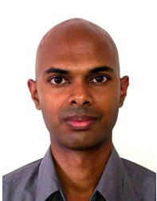
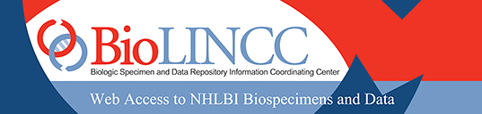

## Outline {.smaller}

- Introduction ( 13:30 - 13:45 )

- Visualisation with R ( 13:45 - 16:00 )
    * Use of grammar of graphics
    * Use of shiny documents
    * Coffee break from 15:00 - 15:30

- Inference and Modeling with R ( 16:00 - 17:00 )

# ABOUT THE WORKSHOP

## BDAH 2014 {.smaller}

 

The **International Conference on Big Data and Analytics in Healthcare 2014** ([BDAH 2014](http://chi.nus.edu.sg/conference2014/)) provides a platform for healthcare decision makers, researchers, administrators, care-providers and industry leaders and representatives to gain insights into the strategies and analytic tools and techniques for dealing with big data in healthcare. It also provides the opportunity for participants to network with experts and share experience to deal with the oncoming data analytic challenges posed by big data.

This workshop is the BDAH 2014 [Pre-conference Workshop](http://chi.nus.edu.sg/conference2014/programme.html#workshops) #4.

## Synopsis {.smaller}

Increasingly, healthcare analytics professionals are faced with larger and more complex datasets. The pressure is on the analysts to understand the intricate relationships among many healthcare variables, and to then provide actionable insights.

This workshop aims to be a self-contained, practical and case-based introduction to healthcare analytics with open-source R. We start by learning sufficient programming fundamentals of R necessary for the workshop. Subsequently, we cover an essential tool for exploratory data analysis (EDA) --- visualization --- through which we can gain a good intuition of variable relationships in a dataset. This section consists of two types of visualization techniques: conditional plotting by applying the "grammar of graphics", and interactive graphs. EDA encourages an analyst to first have an intimate understanding of the data, and then possibly formulate hypotheses that may lead to new data collection and experiments. Therefore, in the final section, we learn how to draw inferences about population parameters by testing hypotheses about them using appropriate sample statistics. This section consists of inferential methods applied to one and more samples, and to continuous and categorical data.

Concepts in all three sections of the workshop will be illustrated with one consistent real-world healthcare dataset. The attendees therefore are able to see the overall work flow of an analyst, and understand which R packages and functions to apply at different stages of the case study.

<!---

## Educationl Objectives

- The primary educationl objective of this workshop is to get R users (including those who are new to R) to a level where they can comfortably carry out the following tasks:

    - Exploratory data analysis via visualizations, and

    - Basic inference and modeling.

- To assist in achieving the primary objective, the presenters will share all our R code on GitHub before the workshop itself. We trust that this approach will help overcome the initial barriers to using or switching to R. By studying and modifying our code, the attendees will be able to carry out similar analyses on their own datasets almost immediately.

-->

## Speaker: Vik {.smaller}

 

Online profile:   <http://www.stat.nus.edu.sg/~stavg>

**Vik Gopal** obtained his PhD from the University of Florida, with a dissertation on running Markov chains in parallel. Upon graduation, he joined the IBM Research Collaboratory in Singapore and worked with government agencies on traffic prediction and weather modeling problems. Vik is currently working at the [National University of Singapore (NUS)](http://www.nus.edu.sg) as a Lecturer in the Department of Statistics and Applied Probability.

Vik has been using R for close to 10 years now, and is an ardent fan due to its vast library of user-contributed statistical routines and excellent visualization capabilities.

Vik teaches R in his classes at NUS, and presented his R packages at useR! 2013 and 2014. His latest package [popKorn](http://cran.r-project.org/web/packages/popKorn) is now available on CRAN.

## Speaker: Dan {.smaller}

 

Online profile:   <http://www.linkedin.com/in/wudanprofile>

**Wu Dan** heads the Healthcare Analytics Unit at [Khoo Teck Puat Hospital](http://www.ktph.com.sg), Alexandra Health System, Singapore. At national level, he serves as a part-time professional with the Policy Research and Economics Office at Ministry of Health. Working with a team of data scientists, Dan oversees projects in predictive analytics and operations research that generate actionable insights to enable better patient care. 

Dan is a founding executive committee member of Healthcare Analytics Research and Technologies Singapore ([HEARTS](http://www.gai.nus.edu.sg/hearts)), and an executive committee member of Association for Medical and Bio-Informatics Singapore ([AMBIS](http://www.ambis.org.sg)).

Dan uses R at work, and conducted sharing sessions on R for healthcare at Singapore R User Group meetups, the International Conference on Big Data and Analytics in Healthcare 2013, and the Healthcare Quality Society of Singapore Quality Forum 2013.

# PRE-WORKSHOP MATERIALS

## Install Both [R](http://www.r-project.org) and [RStudio](http://www.rstudio.com) to Get Started

<iframe width="560" height="315" src="http://www.youtube.com/embed/cX532N_XLIs?rel=0" frameborder="0" allowfullscreen></iframe>

## R Packages Required

- [`dplyr`](http://cran.r-project.org/web/packages/dplyr): Grammar of data manipulation

- [`ggplot2`](http://cran.r-project.org/web/packages/ggplot2): An implementation of [*The Grammar of Graphics*](http://www.springer.com/statistics/computational+statistics/book/978-0-387-24544-7)

- [`shiny`](http://cran.r-project.org/web/packages/shiny): A web application framework for R

## How to Install Packages in RStudio? 

<iframe width="420" height="315" src="http://www.youtube.com/embed/u1r5XTqrCTQ?rel=0" frameborder="0" allowfullscreen></iframe>

## Optional: Why Is RStudio Better than R Alone?

<iframe width="420" height="315" src="http://www.youtube.com/embed/3cLcgAbrUfk?rel=0" frameborder="0" allowfullscreen></iframe>

## Case: Framingham Heart Study {.smaller}

 

- On 29 September 2013, the [Framingham Heart Study (FHS)](http://www.framinghamheartstudy.org) celebrated 65 years since the examination of the first volunteer in 1948. During this period, the landmark study has provided substantial insight into the epidemiology and risk factors of cardiovascular disease. The origins of the study are closely linked to the cardiovascular health of President Franklin D. Roosevelt and his premature death from hypertensive heart disease and stroke in 1945.

- [A *Lancent* article](http://www.thelancet.com/journals/lancet/article/PIIS0140-6736(13)61752-3/abstract) by Dr. Mahmood and team gave an excellent historical overview of selected contributions from the FHS.

- We use the FHS as **the** case study for this workshop.

## FHS and Risk Factors of Heart Disease

<iframe width="560" height="315" src="http://www.youtube.com/embed/xIRQXz4LRso?rel=0" frameborder="0" allowfullscreen></iframe>

## Dataset

 

- The dataset we use for this workshop is a [publicly available](https://biolincc.nhlbi.nih.gov) subset of the FHS data, and includes laboratory, clinic, questionnaire, and event data on 4,434 participants.

- Download the dataset [here](https://raw.githubusercontent.com/singator/bdah/master/data/frmgham2.csv).

- [This documentation](https://biolincc.nhlbi.nih.gov/static/studies/teaching/framdoc.pdf) for the Framingham dataset contains a variable list and coding help for the data.

## See You on 22 July at Marina Bay Sands Expo and Convention Center Singapore

 

Bring your laptop if you wish to have hands-on learning!

Cheers,
 
Vik and Dan

